

# sql2solution

### 🚀 SQL Server to professional ASP.NET Core API solutions, faster.

**sql2solution** helps developers turn SQL database structure into clean, repeatable, production-minded .NET solutions with APIs, client UI, Swagger documentation, security options, and validation workflows.

Visit the official website: **[https://sql2solution.com/](https://sql2solution.com/)**

---

## ✨ What Is sql2solution?

sql2solution is a deterministic SQL-to-solution generator for developers and teams building SQL-backed .NET products. It is designed for professional workflows where repetitive API plumbing, Swagger setup, DTO wiring, client screen generation, and validation checks slow down delivery.

Instead of relying on AI-generated source code, sql2solution uses handcrafted deterministic templates so output stays predictable, readable, and easier for developers to extend.

## 🔎 Built For Developers Searching For

- .NET Core API generator
- ASP.NET Core API generator
- SQL Server to API generator
- SQL database to .NET API
- SQL to Swagger / OpenAPI
- SQL Server to Blazor app
- SQL Server to Razor Pages
- Multi-tenant .NET API generator
- Clean architecture .NET generator
- CRUD API generator for .NET

## 🧰 What sql2solution Helps Generate

| Area | Details |
| --- | --- |
| ASP.NET Core APIs | Generate endpoint structure, API contracts, DTO patterns, and documented API surfaces from SQL metadata. |
| SQL Server Workflows | Start from database tables, columns, relationships, keys, indexes, and real schema behavior. |
| Swagger / OpenAPI | Produce API documentation that developers and client teams can inspect immediately. |
| Razor Pages | Generate API-connected Razor client screens for practical admin and business workflows. |
| Blazor UI | Generate Blazor client UI patterns connected to generated API endpoints. |
| Single-Tenant Apps | Build simpler SQL-backed business apps with straightforward identity and data access assumptions. |
| Multi-Tenant Apps | Generate tenant-aware project structure, tenant defaults, authorization patterns, and cross-tenant safety checks. |
| Security Controls | Support authentication, authorization, JWT bearer settings, roles, policies, permissions, and related configuration. |
| Operations | Generate patterns for health checks, structured logging, correlation IDs, problem details, and runtime readiness. |
| Validation | Use smoke-test and back-to-back validation points to confirm APIs, clients, Swagger, and generated output still align. |

## 🛠️ Solution Configuration

The Solution Configuration workflow is where sql2solution turns a SQL Server schema into a controlled .NET generation plan. These walkthroughs show how developers can load a project, validate database metadata, choose architecture, configure API styles, manage DTO rules, and set solution-wide defaults before generating code.

Use the toggles below to explore each configuration area.

<strong>🧭 Solution Configuration Overview</strong>

Configure the core solution settings before generation begins: project shape, naming, target framework, API behavior, client output, and generation conventions. This gives teams a repeatable setup for SQL-backed ASP.NET Core API projects instead of rebuilding the same decisions by hand for every database.

**✅ Benefit:** Developers can standardize the generated solution early, reduce setup mistakes, and keep project structure consistent across client work, internal tools, and SaaS products.

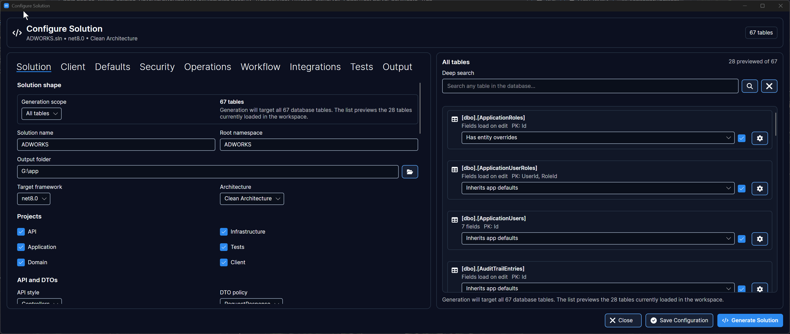

<strong>📂 Load An Existing sql2solution Project</strong>

Open an existing sql2solution configuration and continue working from saved project settings. This is useful when a schema changes, a client requests new behavior, or a team wants to regenerate parts of a solution without starting from scratch.

**✅ Benefit:** Saved configurations make the generator practical for real projects that evolve over time, not just one-off demos.

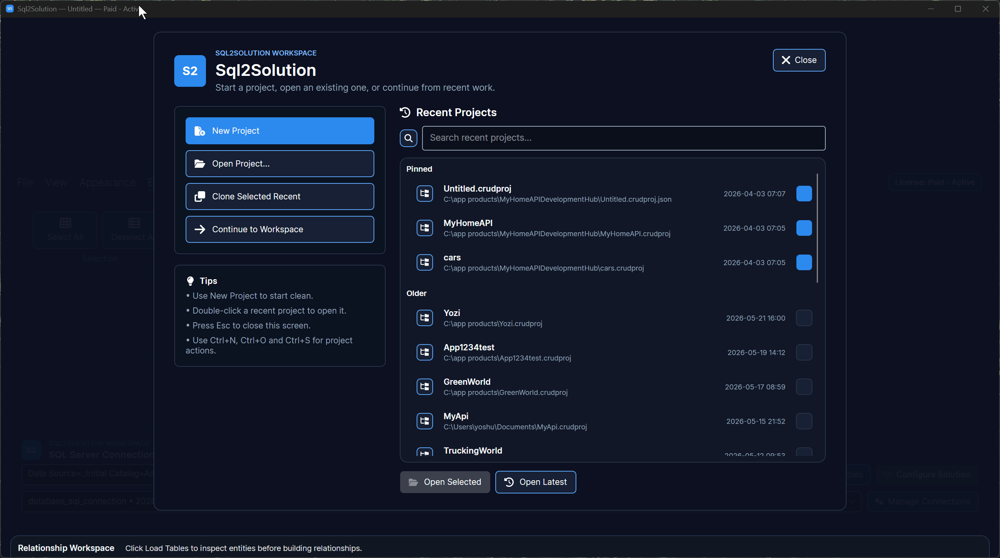

<strong>🧾 SQL Table Entity Loading And Validation</strong>

Load table metadata and validate entities before code generation. sql2solution can surface table structure, fields, keys, relationships, and schema issues so developers can make generation decisions from real database metadata.

**✅ Benefit:** Early validation helps avoid broken generated endpoints, missing relationships, incorrect DTOs, and late surprises after code has already been produced.

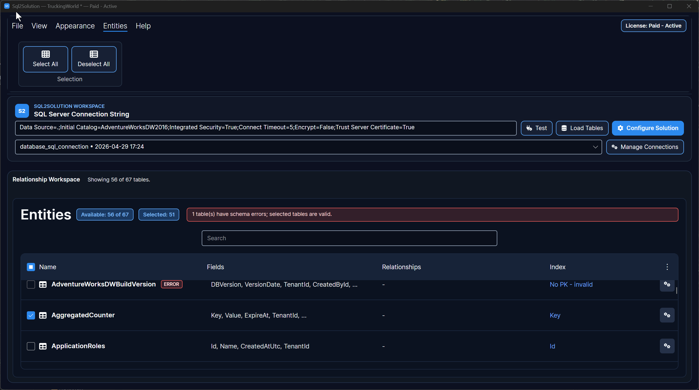

<strong>🔌 Manage SQL Server Connection Strings By Environment</strong>

Create and organize multiple SQL Server connection strings for different environments, clients, databases, or deployment targets. Environment-aware configuration keeps development, staging, test, and production settings easier to manage.

**✅ Benefit:** Teams can switch contexts quickly and reduce connection-string mistakes when generating APIs from multiple SQL Server databases.

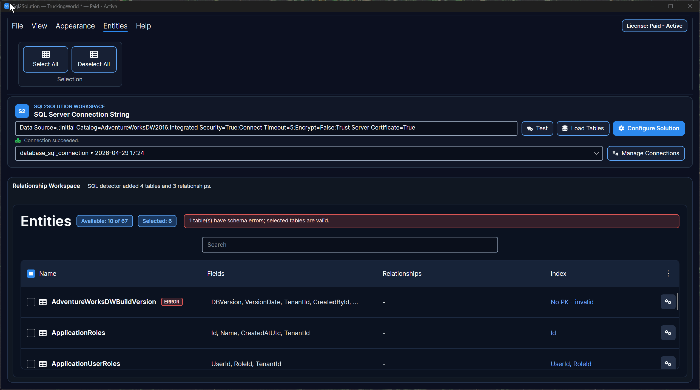

<strong>🏗️ Supported Architecture Options</strong>

Choose the generated architecture style, including controller-based APIs, service-layer patterns, clean architecture, and minimal API approaches. The generator can support different project styles instead of forcing every solution into one shape.

**✅ Benefit:** Developers can match generated output to the architecture their team already uses, which makes adoption easier and keeps generated code aligned with existing engineering standards.

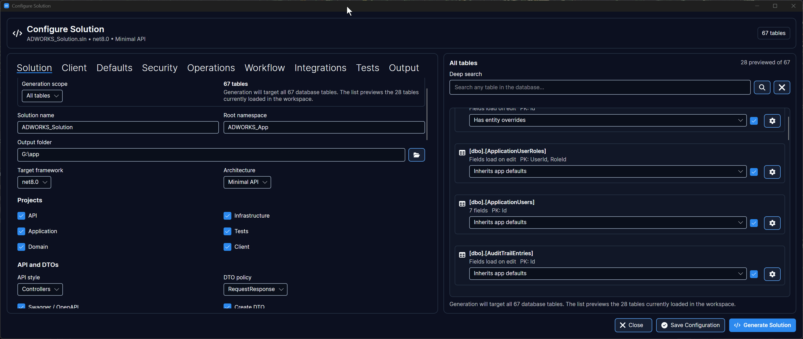

<strong>🧱 Include Or Exclude .NET Solution Project Layers</strong>

Decide which .NET project layers should be included in the generated solution. Teams can create leaner projects for simple tools or fuller layered solutions for production systems with API, application, domain, infrastructure, tests, and client needs.

**✅ Benefit:** The generated solution stays proportional to the project instead of adding unnecessary layers or leaving out structure the team needs later.

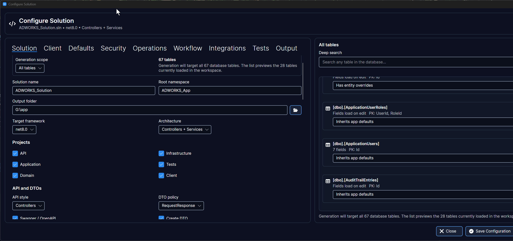

<strong>⚙️ API And DTO Styles: CQRS, MediatR, Controllers, Minimal APIs</strong>

Configure API style and DTO generation choices, including CQRS, MediatR, controllers, and minimal API patterns. This lets developers generate code that fits their preferred ASP.NET Core conventions and application complexity.

**✅ Benefit:** Teams can avoid hand-converting generated output to match their stack because the generator starts closer to the desired architecture.

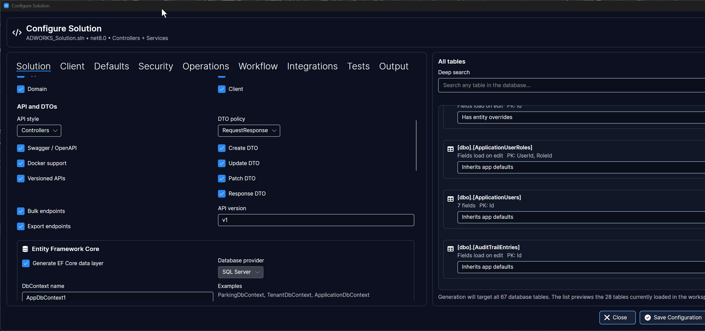

<strong>📦 DTO Policy: Request, Response, Entity, Command, And Query DTOs</strong>

Define how sql2solution creates DTOs for API requests, responses, entities, commands, and queries. Clear DTO policy helps separate external API contracts from internal persistence and domain behavior.

**✅ Benefit:** Better DTO control improves maintainability, reduces accidental data exposure, and gives client applications cleaner contracts to consume.

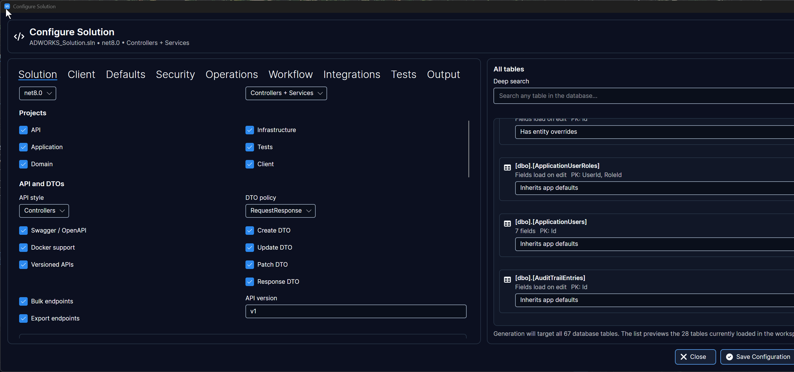

<strong>🗄️ Entity Framework Core Configuration</strong>

Configure Entity Framework Core generation behavior for SQL-backed .NET projects. This helps shape how database metadata becomes C# persistence configuration, entity mapping, and data access conventions.

**✅ Benefit:** Consistent EF Core configuration reduces repetitive mapping work and makes generated infrastructure easier to review, test, and extend.

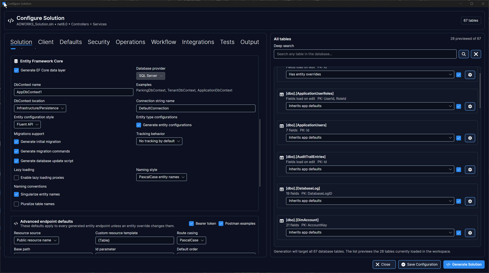

<strong>🌐 Global Solution Endpoint Defaults</strong>

Set solution-wide endpoint defaults once and apply them consistently across generated APIs. Global defaults can cover repeated API behavior that should remain predictable across tables and entities.

**✅ Benefit:** Teams get consistent generated endpoints, fewer manual edits, and less risk that each entity behaves like a separate one-off implementation.

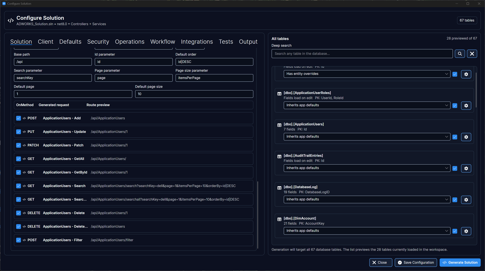

<strong>🎛️ Advanced Endpoint Defaults</strong>

Fine-tune advanced endpoint behavior for generated ASP.NET Core APIs. These settings help teams control API behavior beyond the basic CRUD path, especially when projects need stronger conventions around generated operations.

**✅ Benefit:** Advanced defaults let developers make deeper API decisions before generation, saving manual endpoint cleanup after the solution is created.

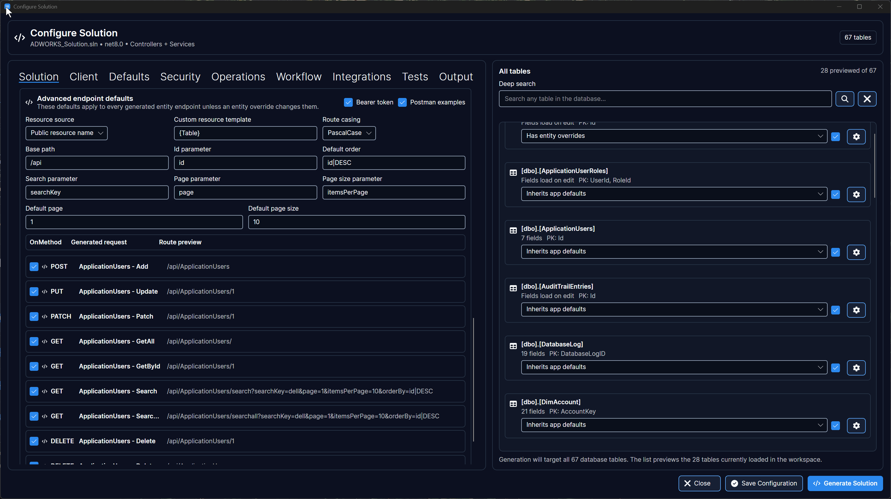

<strong>🎯 Entity-Specific Endpoint Defaults</strong>

Override global endpoint defaults for a specific entity when one table needs different API behavior. This is useful when most endpoints should follow the same convention, but important entities need special handling.

**✅ Benefit:** Developers get the speed of global conventions while keeping the flexibility to model exceptions without hand-editing generated code later.

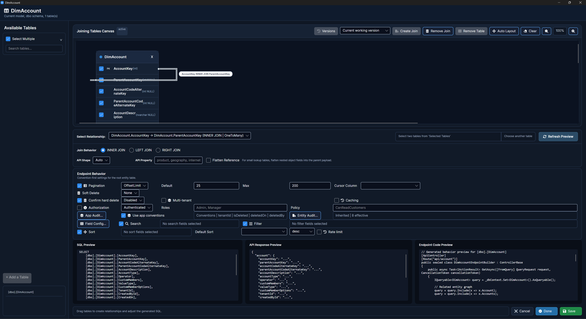

<strong>🧩 Endpoint Field Configuration Per Entity</strong>

Configure fields for each generated entity endpoint, including whether a field should be searchable, filterable, editable, visible, or assigned a default value. This lets sql2solution generate APIs and client behavior that better match the real purpose of each SQL table.

**✅ Benefit:** Developers can prevent accidental field exposure, reduce repetitive manual DTO edits, and produce cleaner entity-specific APIs from the start.

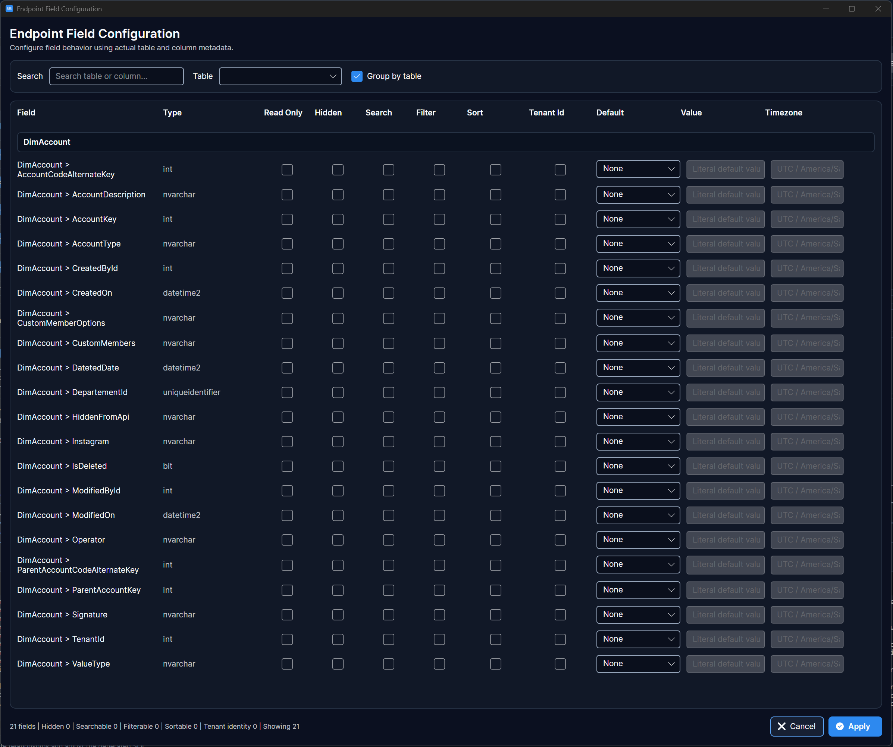

<strong>🕵️ Audit Fields With Defaults And Validation</strong>

Seed standard audit fields or create and modify custom audit fields with validation rules. Teams can define lifecycle fields, soft-delete fields, required values, read-only behavior, and defaults before generating the solution.

**✅ Benefit:** Consistent audit fields make generated .NET APIs easier to govern, easier to debug, and safer for business workflows that need traceability.

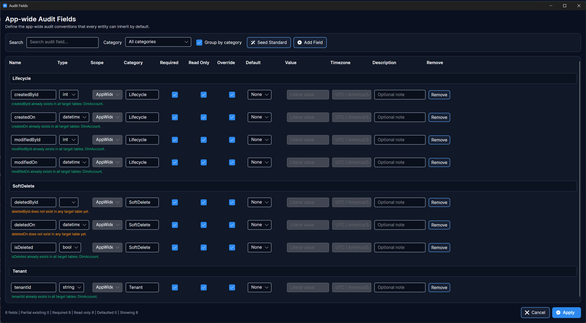

<strong>🏢 Per-Entity Multi-Tenant, Cache, Claim, Delete, And Pagination Controls</strong>

Control entity-specific behavior for multi-tenant solutions, including caching, query variation, validate-on-write behavior, claims, soft delete or hard delete, and pagination. This gives each generated entity the right runtime behavior instead of forcing one global pattern everywhere.

**✅ Benefit:** Teams can generate safer tenant-aware APIs, tune performance-sensitive entities, and keep delete and pagination behavior aligned with real business rules.

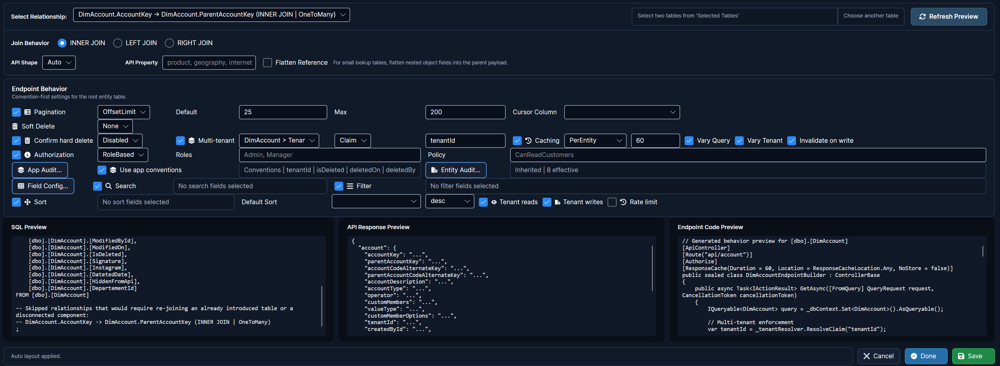

<strong>🕒 Entity Configuration Version History And Revert</strong>

Keep versions of each entity configuration so developers can compare changes and revert to an earlier setup when needed. This is useful when testing generation options, changing endpoint behavior, or recovering a known-good configuration after experimentation.

**✅ Benefit:** Version history reduces risk while tuning generated APIs, because teams can iterate on configuration without losing a working baseline.

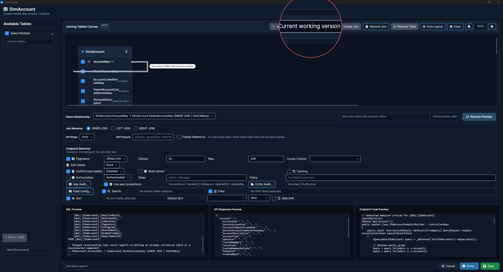

<strong>🔁 Generate Different API Versions</strong>

Configure API versioning so generated ASP.NET Core endpoints can support versioned contracts. Versioning is important when clients depend on stable APIs while the database and product continue to evolve.

**✅ Benefit:** API version generation helps teams plan for backward compatibility, client migrations, and cleaner long-term API lifecycle management.

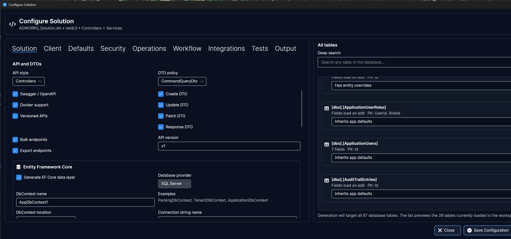

## 🚦 Product Workflow Walkthroughs

These walkthroughs show the parts of sql2solution that help teams move beyond basic CRUD generation: client apps, security, runtime operations, realtime integrations, workflow automation, test generation, output management, and production-readiness checks.

<strong>🎨 Optional Client Generation: Razor Pages And Blazor Web App</strong>

Generate an optional client project alongside the backend API. sql2solution can create client-facing project structure for Razor Pages or Blazor-style web app workflows so the generated backend has a practical UI path from the beginning.

**✅ Benefit:** Teams can validate generated APIs faster with real screens, reduce frontend setup time, and give stakeholders something useful to review earlier in the project.

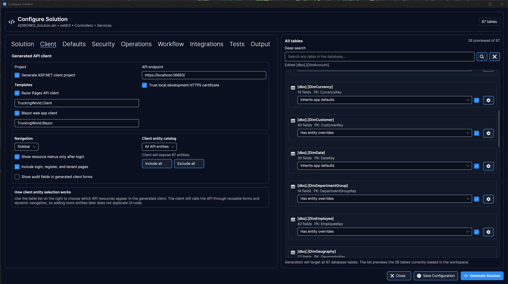

<strong>🧬 Default Audit, Multi-Tenant, Pagination, Caching, And Query Behaviors</strong>

Configure default generation behavior for audit fields, tenant-aware data access, pagination, caching, and query rules. These defaults help shape how generated APIs behave across the solution before individual entities are customized.

**✅ Benefit:** Teams can define consistent data access and API behavior once, then generate cleaner endpoints with fewer manual corrections after code creation.

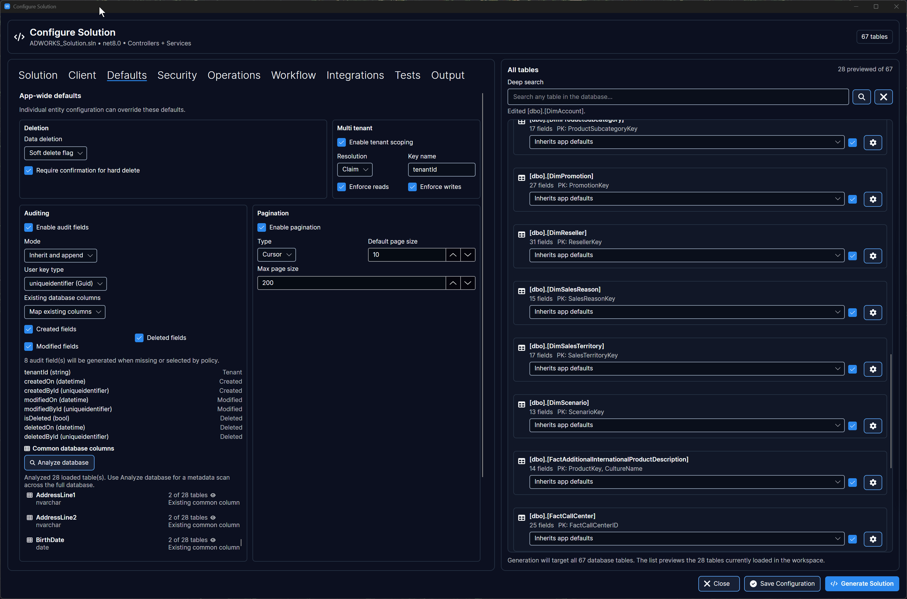

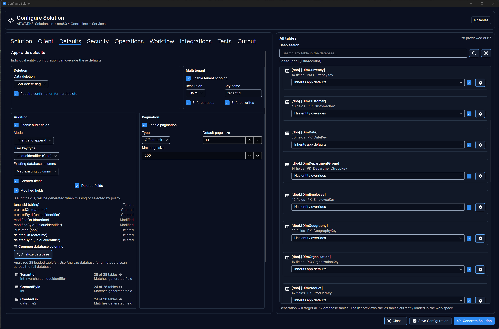

<strong>🔐 Security: Authentication, Authorization, Roles, Policies, And RBAC</strong>

Enable authentication, choose providers, configure authorization modes, define roles and policies, and prepare enterprise-style access controls with RBAC bootstrap options for generated ASP.NET Core APIs.

**✅ Benefit:** Security becomes part of the generated foundation instead of a late project add-on, helping teams build safer APIs with clearer access rules from the start.

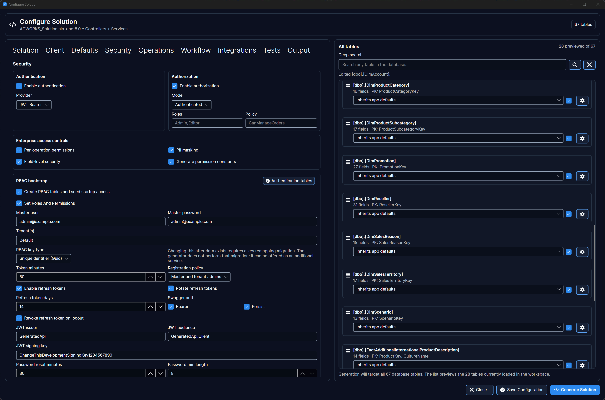

<strong>🛡️ Operations: Runtime Resilience, Observability, And Rate Limiting</strong>

Configure runtime operation features such as resilience patterns, observability, structured runtime readiness, and rate limiting. These settings help generated APIs behave more like production services instead of simple demo endpoints.

**✅ Benefit:** Teams can prepare generated APIs for monitoring, reliability, and controlled traffic earlier in the development lifecycle.

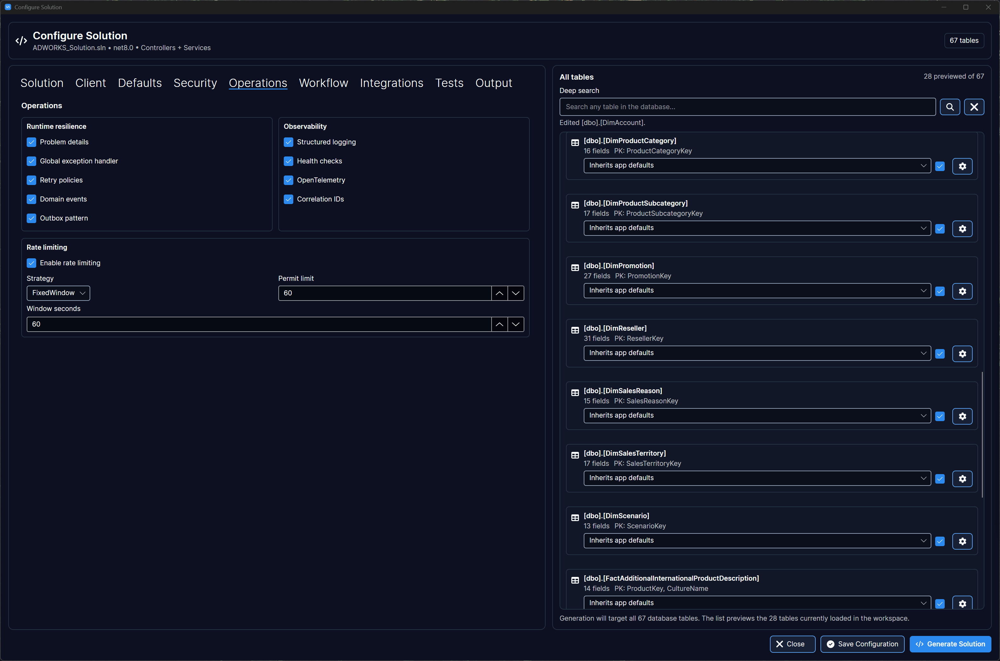

<strong>⚡ SignalR Realtime Integration For Client UI Refresh</strong>

Enable SignalR integration so generated client screens can respond to backend data changes without requiring users to refresh the page. This creates a stronger foundation for realtime dashboards, admin tools, and collaborative business workflows.

**✅ Benefit:** Generated apps can feel more responsive and modern, while developers get a starting point for richer realtime features.

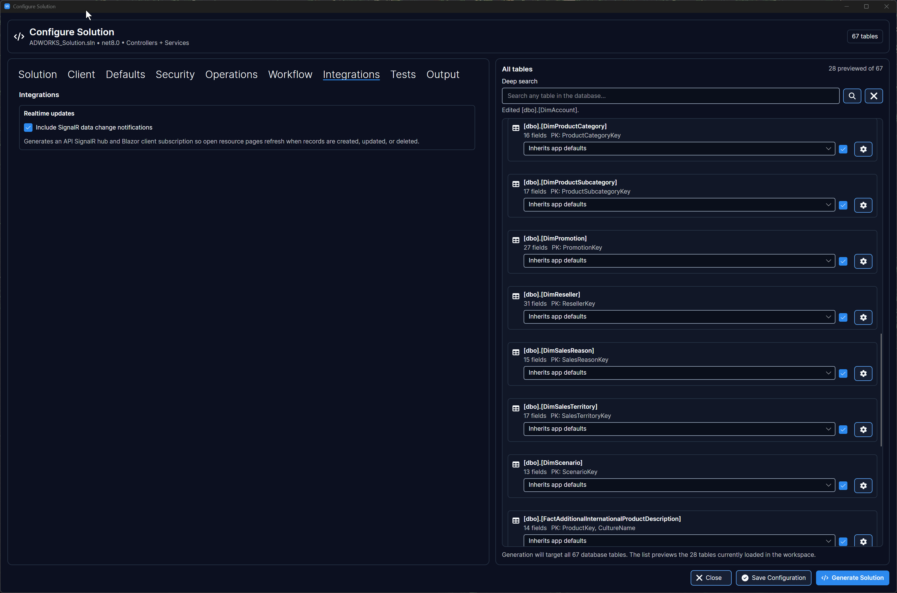

<strong>🔄 Workflow And State Machine Generation</strong>

Configure workflow and state machine behavior for generated entities. This helps teams model lifecycle transitions, status-driven actions, and structured business processes directly in the generated solution plan.

**✅ Benefit:** Developers can generate more than simple CRUD endpoints by adding business-state behavior that mirrors real operational workflows.

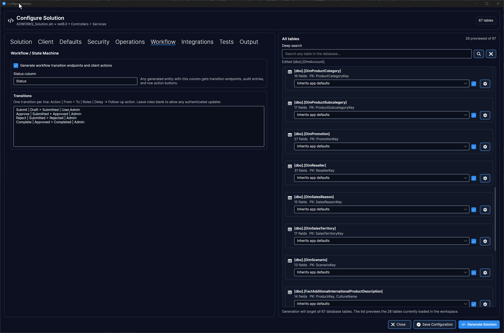

<strong>🧪 Test Section And Smoke Tests</strong>

Include tests in the generated solution and let sql2solution prepare smoke-test workflows after the solution is created. This helps verify that generated APIs, configuration, and expected runtime behavior are still aligned.

**✅ Benefit:** Teams can catch broken generation assumptions earlier and ship with more confidence because validation is part of the generated project workflow.

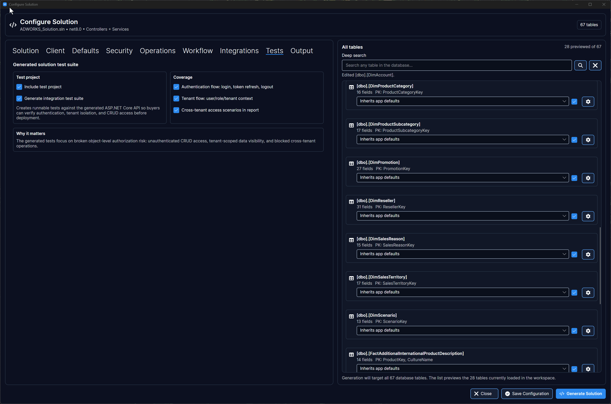

<strong>📤 Output Management: CI Pipeline, Postman, EF Core Migrations, API Validation, And Smoke Tests</strong>

Manage generated solution outputs before or after creation, including CI pipeline assets, Postman collections, EF Core migration management, API validation, and smoke-test execution.

**✅ Benefit:** sql2solution helps teams move from code generation to project delivery by preparing the supporting artifacts needed for testing, integration, automation, and handoff.

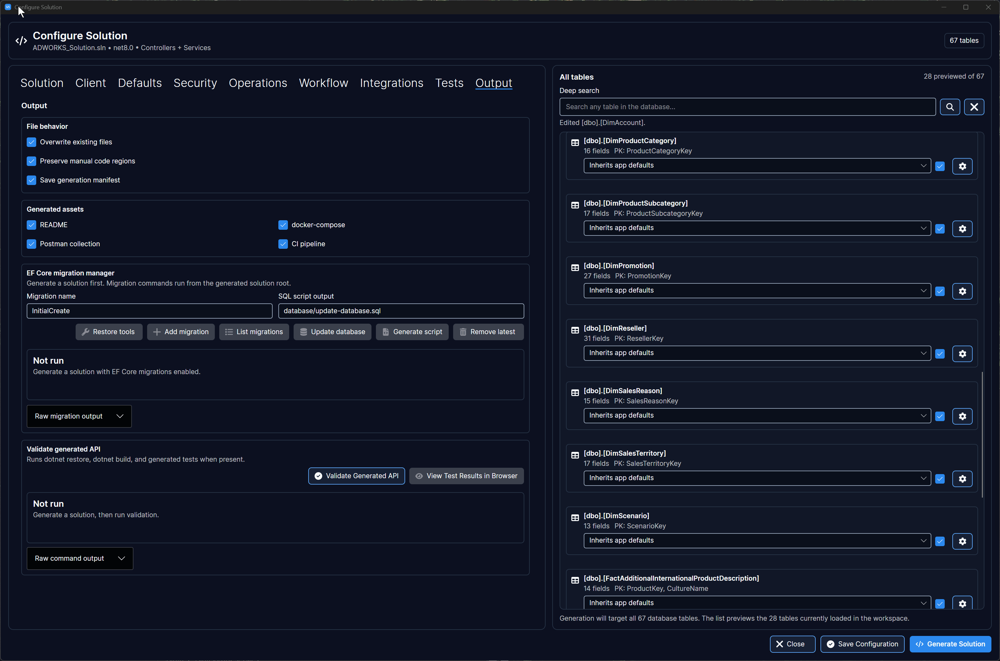

## 💡 Why It Exists

Building SQL-backed .NET applications often means repeating the same work:

- Create controllers and endpoints
- Map entities, DTOs, and request models
- Configure Swagger and OpenAPI
- Build Razor or Blazor client screens
- Add tenant-aware security rules
- Wire audit fields and lifecycle behavior
- Create tests and smoke checks
- Keep generated layers consistent as the schema changes

sql2solution exists to make that repeatable. Developers still own the final product, architecture decisions, business rules, and extensions, but they start from a generated foundation instead of a blank project.

## ⭐ Key Product Capabilities

### 🟣 .NET 8, .NET 9, and .NET 10 Targets

Generate modern .NET solution structures for current and upcoming application stacks.

### 🗃️ SQL-First Generation

Use SQL Server schema metadata as the source for generating APIs, clients, fields, relationships, and validation behavior.

### 🧼 Clean, Readable C# Output

Generated code is intended to be understandable, reviewable, and extensible by real developers.

### 📘 API Documentation Included

Generated APIs can be shaped for Swagger and OpenAPI discoverability, making endpoint testing and client integration easier.

### 🖥️ Client UI Generation

Generate Razor Pages and Blazor client experiences connected to the API layer.

### 🏢 Tenant-Aware Options

Support both single-tenant and multi-tenant application patterns, including tenant context and cross-tenant access validation.

### ✅ Quality And Validation

Use smoke-test coverage points and back-to-back checks to confirm API startup, Swagger availability, endpoint responses, and client route behavior.

## 🎯 Example Use Cases

- Internal admin systems backed by SQL Server
- SaaS products that need tenant-aware data access
- CRUD-heavy business applications
- Client portals and operational dashboards
- Data management tools
- API-first modernization of existing SQL databases
- Fast prototypes that need to become maintainable production code

## 🌍 Official Website

The public website and product details live at:

**[https://sql2solution.com/](https://sql2solution.com/)**

This GitHub repository is a public discovery page for the product. It intentionally does not expose the private website source code or production assets.

## 🏷️ Search Keywords

`sql2solution` · `.NET Core API generator` · `ASP.NET Core API generator` · `SQL Server API generator` · `SQL to API` · `SQL to .NET Core API` · `.NET CRUD generator` · `Swagger API generator` · `OpenAPI generator` · `Blazor generator` · `Razor Pages generator` · `multi tenant .NET API` · `database to API generator`

